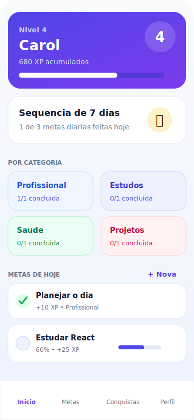
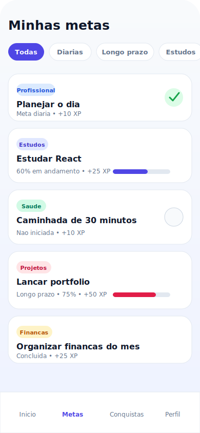
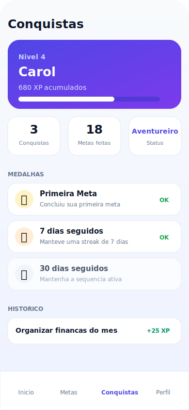
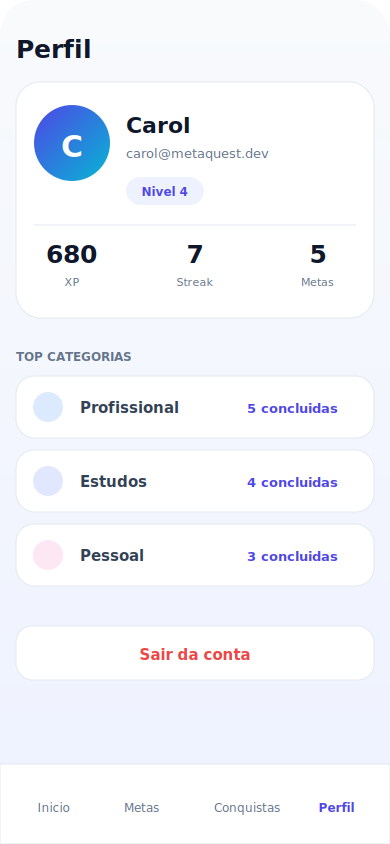

# MetaQuest Frontend

Frontend do MetaQuest, uma aplicação web para acompanhar metas pessoais e profissionais com gamificação, XP, níveis, streaks e conquistas.

## Telas

<p align="center">
  
  
  
  
  
</p>

## Stack

- React 19
- TypeScript
- Vite
- TanStack Router
- Tailwind CSS
- Radix UI
- Lucide React
- Sonner para notificações

## Requisitos

- Node.js
- npm
- Backend do MetaQuest rodando localmente

O backend esperado fica, por padrão, em:

```txt
http://localhost:3333
```

## Configuração

Crie um arquivo `.env` a partir do exemplo:

```bash
cp .env.example .env
```

Variável usada pelo frontend:

```env
VITE_API_URL=http://localhost:3333
```

O arquivo `.env` é local e não deve ser versionado.

## Instalação

```bash
npm install
```

## Rodando em desenvolvimento

```bash
npm run dev
```

Para usar a mesma origem configurada no backend local:

```bash
npm run dev -- --host localhost --port 8080
```

Abra no navegador:

```txt
http://localhost:8080
```

## Scripts

```bash
npm run dev
```

Inicia o servidor de desenvolvimento.

```bash
npm run build
```

Gera o build de produção.

```bash
npm run preview
```

Pré-visualiza o build gerado.

```bash
npm run lint
```

Executa o ESLint.

```bash
npm run format
```

Formata o projeto com Prettier.

## Integração com Backend

A camada de API fica em:

```txt
src/lib/api.ts
```

Ela centraliza:

- URL base da API via `VITE_API_URL`
- Token JWT em `localStorage`
- Login, cadastro e logout
- Perfil do usuário
- Metas
- Conclusão de metas diárias
- Conclusão de metas de longo prazo
- Atualização de progresso
- Tratamento de erros da API

Rotas esperadas do backend:

- `POST /auth/register`
- `POST /auth/login`
- `POST /auth/logout`
- `GET /auth/me`
- `POST /auth/forgot-password`
- `POST /auth/change-password`
- `GET /profile`
- `PATCH /profile`
- `GET /goals`
- `POST /goals`
- `PATCH /goals/:id`
- `DELETE /goals/:id`
- `POST /goals/:id/complete-daily`
- `POST /goals/:id/complete-long-term`
- `PATCH /goals/:id/progress`

## Estado da Aplicação

O projeto usa Context API:

- `src/lib/auth.tsx`: autenticação e sessão
- `src/lib/metaquest/store.tsx`: estado de metas, perfil gamificado e ações da aplicação

O backend é a fonte da verdade para metas, progresso, reset diário, XP e conquistas. O frontend apenas busca os dados atualizados e reflete a resposta da API.

## Reset Diário de Metas

O reset das metas diárias é responsabilidade do backend.

O frontend:

- busca metas atualizadas ao abrir ou recarregar o app
- refaz a busca quando a aba volta ao foco
- refaz a busca quando detecta mudança de dia
- substitui o estado local pela resposta da API
- evita exibir uma missão diária concluída de um dia anterior

Campos tratados para metas diárias:

- `progress`
- `completed`
- `completedAt`
- `lastCompletedDate`
- `lastResetDate`

## Estrutura Principal

```txt
src/
  components/
    auth/
    metaquest/
    ui/
  lib/
    api.ts
    auth.tsx
    metaquest/
      store.tsx
      types.ts
      leveling.ts
  pages/
  routes/
```

## Rotas do Frontend

- `/`
- `/login`
- `/register`
- `/forgot-password`
- `/dashboard`
- `/goals`
- `/add-goal`
- `/gamification`
- `/profile`
- `/profile/edit`
- `/profile/change-password`
